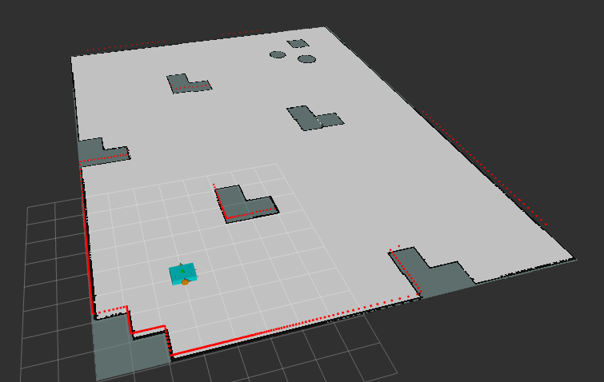

# localization_bringup



A flexible ROS 2 launch package for starting SLAM or localization using `slam_toolbox`, with support for both **synchronous** and **asynchronous** modes, plus optional RViz visualization.

## 💡 What It Does

This launch file can:
- Start `slam_toolbox` in either async or sync mode
- Enable **localization-only** mode if needed
- Optionally start RViz with a preconfigured `.rviz` file
- Support simulated or real-time clock via `use_sim_time`


## 🚀 How to Launch

### Basic usage (async SLAM in mapping mode + RViz):
```bash
ros2 launch localization_bringup localization.launch.py
```

## 🛠️ Launch Arguments

| Argument         | Default | Choices       | Description                           |
|------------------|---------|---------------|---------------------------------------|
| `use_sim_time`   | `true`  | `true/false`  | Use Gazebo/sim time                   |
| `sync`           | `false` | `true/false`  | Use synchronous SLAM mode             |
| `localization`   | `false` | `true/false`  | Run in localization-only mode         |
| `use_rviz`       | `true`  | `true/false`  | Launch RViz with preconfigured view   |


### Run in localization mode while using asynchronous mode:
```bash
ros2 launch localization_bringup localization.launch.py localization:=true sync:=false
```

### Run in localization mode while using synchronous mode:
```bash
ros2 launch localization_bringup localization.launch.py localization:=true sync:=true
```

### Run in mapping mode while using asynchronous mode:
```bash
ros2 launch localization_bringup localization.launch.py sync:=false
```

### Run in mapping mode while using synchronous mode:
```bash
ros2 launch localization_bringup localization.launch.py sync:=true
```

### Disable RViz:
```bash
ros2 launch localization_bringup localization.launch.py use_rviz:=false
```

### Real-time (hardware) mode:
```bash
ros2 launch localization_bringup localization.launch.py use_sim_time:=false
```

## 🧠 Notes

- Make sure your robot or sim publishes TF and `/scan` for SLAM toolbox to work.
- This setup assumes you have launch default simulation environment in gazebo_bringup(six_waypoints)


## 👨‍💻 Author
Made with ❤️ by Manoj M